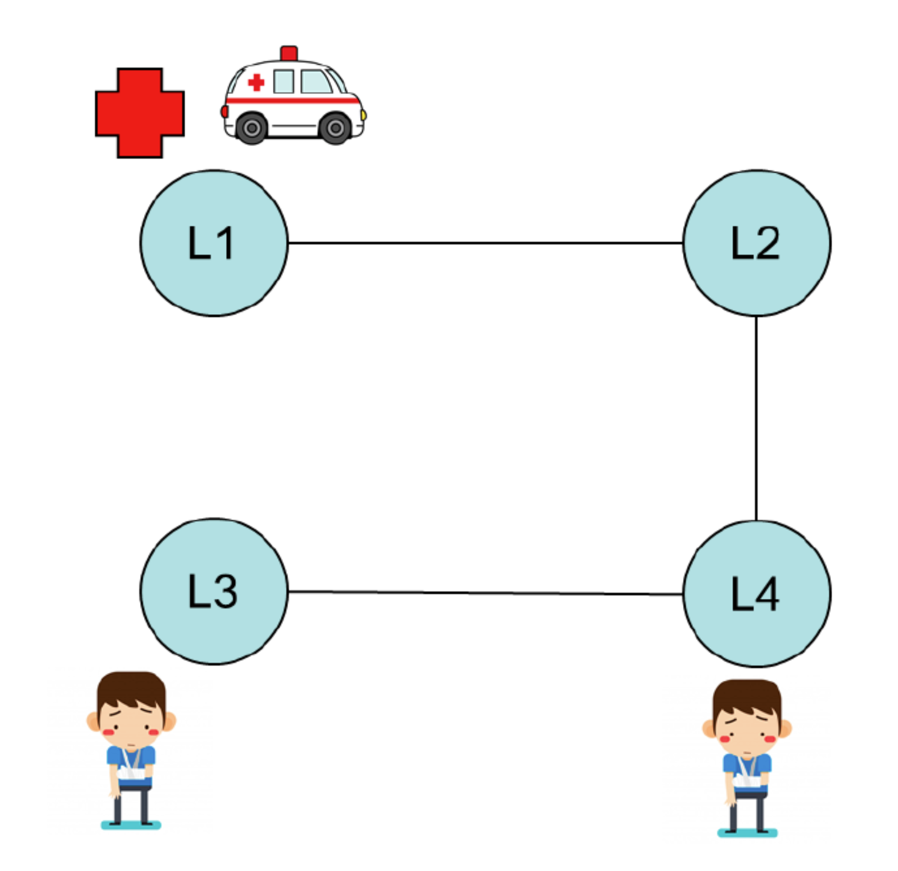
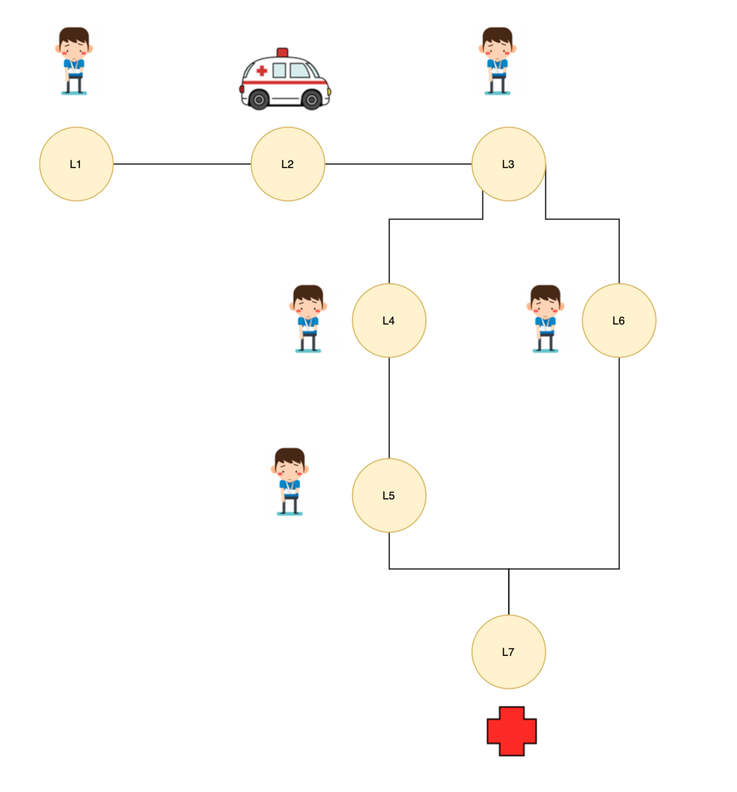
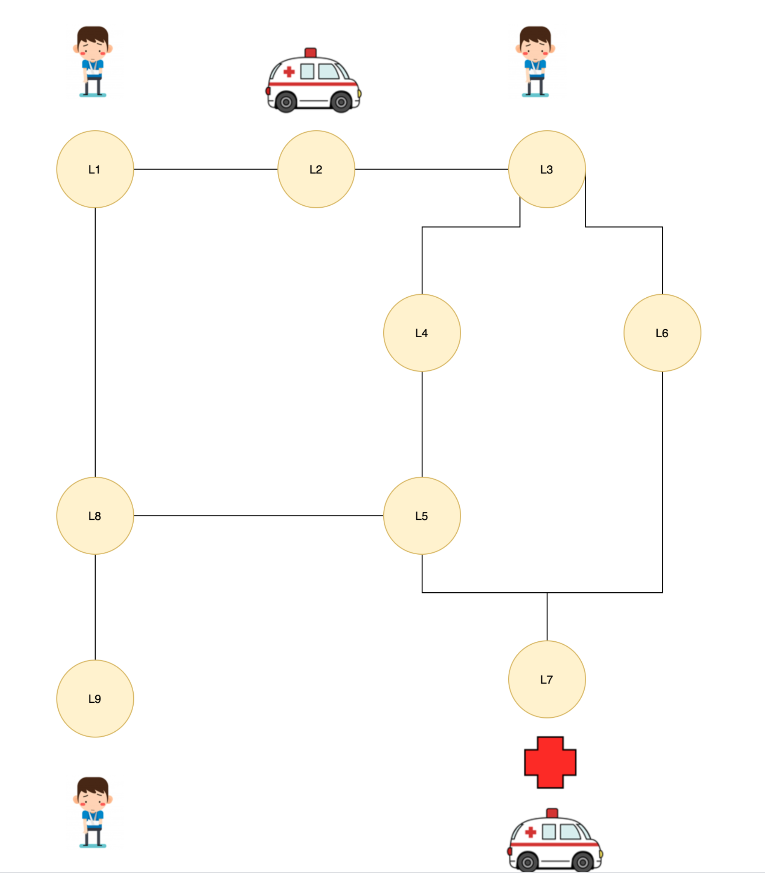

# PDDL Examples

Resolution to problems with PDDL


## Problems

The problems to be resolved are the below:

**Problem1**


**Problem2**


**Problem3**



## Getting started 

To run the purposed solution for the above problem you just need to execute the below command:

```bash
sh run.sh <number_of_problem>
```

where valid identifiers are `1`, `2` or `3` depending on the problem that we want to resolve.

- 1: data/problem.1.pddl
- 2: data/problem.1.pddl
- 3: data/problem.1.pddl


